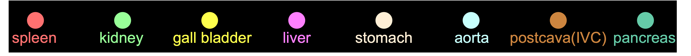

# AbdonmenAtlas-8K

We are proud to introduce AbdomenAtlas-8K, a substantial multi-organ dataset with the spleen, liver, kidneys, stomach, gallbladder, pancreas, aorta, and IVC annotated in **8,448** CT volumes, totaling **3.2 million** CT slices. 

An endeavor of such magnitude would demand a staggering **1,600 weeks** or roughly **30.8 years** of an experienced annotator's time. 

In contrast, our annotation method has accomplished this task in **three weeks** (premised on an 8-hour workday, five days a week) while maintaining a similar or even better annotation quality.

<p align="center"></p>

<p align="center"></p>
<p align="center"></p>

## Paper

<b>Annotating 8,000 Abdominal CT Volumes for Multi-Organ Segmentation in Three Weeks</b> <br/>
[Chongyu Qu](https://github.com/Chongyu1117)<sup>1</sup>, [Tiezheng Zhang](https://github.com/ollie-ztz)<sup>1</sup>, [Hualin Qiao](https://www.linkedin.com/in/hualin-qiao-a29438210/)<sup>2</sup>, [Jie Liu](https://ljwztc.github.io/)<sup>3</sup>, [Yucheng Tang](https://scholar.google.com/citations?hl=en&user=0xheliUAAAAJ)<sup>4</sup>,[Alan L. Yuille](https://www.cs.jhu.edu/~ayuille/)<sup>1</sup>, and [Zongwei Zhou](https://www.zongweiz.com/)<sup>1,*</sup> <br/>
<sup>1 </sup>Johns Hopkins University,  <br/>
<sup>2 </sup>Rutgers University,  <br/>
<sup>3 </sup>City University of Hong Kong,   <br/>
<sup>4 </sup>NVIDIA <br/>
arXiv preprint arXiv:2305.09666 <br/>
[paper](https://arxiv.org/pdf/2305.09666.pdf) | [code](https://github.com/MrGiovanni/AbdomenAtlas) | dataset (coming soon)

## 0. Installation

To create environment and obtain requirements see [installation instructions](document/INSTALL.md).

## 1. Download AI models (trained U-Net)

The model was trained on a combination of 14 publicly available CT datasets, consisting of 3,410 (see details in [CLIP-Driven Universal Model](https://github.com/ljwztc/CLIP-Driven-Universal-Model)).
To download the trained AI segmentation models, please request [here]() (coming soon). 
After submitting the form, download the trained model and save it into `./pretrained_checkpoints/unet.pth`.

## 2. Prepare your datasets

It can be publicly available datasets (e.g., BTCV) or your private datasets. Currently we only take data formatted in nii.gz. This repository will help you assign annotations to these datasets, including 25 organs and 6 types of tumors.

##### 2.1 Download

Taking the BTCV dataset as an example, download this dataset and save it to the `datapath` directory.
```bash
cd $datapath
wget https://www.dropbox.com/s/jnv74utwh99ikus/01_Multi-Atlas_Labeling.tar.gz # 01 Multi-Atlas_Labeling.tar.gz (1.53 GB)
tar -xzvf 01_Multi-Atlas_Labeling.tar.gz
```

##### 2.2 Preprocessing

Generate a list for this dataset.

```bash
cd AbdomenAtlas/
python -W ignore generate_datalist.py --data_path $datapath --dataset_name $dataname --folder img --out ./dataset/dataset_list --save_file $dataname.txt
```

## 3. Generate masks

##### U-Net
```bash
CUDA_VISIBLE_DEVICES=0 python -W ignore test.py --resume pretrained_checkpoints/unet.pth --backbone unet --save_dir $savepath --dataset_list $dataname --data_root_path $datapath --store_result >> logs/$dataname.unet.txt
```

##### Swin UNETR
```bash
CUDA_VISIBLE_DEVICES=0 python -W ignore test.py --resume pretrained_checkpoints/swinunetr.pth --backbone swinunetr --save_dir $savepath --dataset_list $dataname --data_root_path $datapath --store_result >> logs/$dataname.swinunetr.txt
```
To generate attention maps for active learning process (Step 5 [optional]), remember to save entropy and soft predictions by using the options `--store_entropy` and `--save_soft_pred`

## 4. Data Assembly

During the assembly process, we give top priority to the original annotations of the eight target organs from each partially-labeled public abdominal dataset, which are annotated by other annotators. Next, we consider the revised labels from our annotator, giving them a lower priority. Finally, the pseudo labels generated by our AI architectures receive the lowest priority.
```bash
python -W ignore assemble.py --data_path $savepath --dataset_name $dataname --backbone swinunetr --save_dir SAVE_DIR --version V1
```

This is how our AbdonmenAtlas-8K appears
```
    $savepath/
    ├── $dataname_img0001
    ├── $dataname_img0002
    ├── $dataname_img0003
        │── ct.nii.gz
        ├── original_label.nii.gz
        ├── pseudo_label.nii.gz
        └── segmentations
            ├── spleen.nii.gz
            ├── liver.nii.gz
            ├── pancreas.nii.gz
```

## 5. [Optional] Active Learning

If you want to perform the active learning process, you will need the following [active learning instructions](document/active_learning_instructions.md) to generate the attention map for human annotators.

<p align="center"></p>
Figure. Illustration of an attention map.


## TODO

- [ ] Release trained model checkpoints (U-Net and Swin UNETR)
- [ ] Support more data formats (e.g., dicom)
- [ ] Release the code for human in the loop

## Citation 

```
@article{qu2023annotating,
  title={Annotating 8,000 Abdominal CT Volumes for Multi-Organ Segmentation in Three Weeks},
  author={Qu, Chongyu and Zhang, Tiezheng and Qiao, Hualin and Liu, Jie and Tang, Yucheng and Yuille, Alan and Zhou, Zongwei},
  journal={arXiv preprint arXiv:2305.09666},
  year={2023}
}
```

## Acknowledgements
This work was supported by the Lustgarten Foundation for Pancreatic Cancer Research and partially by the Patrick J. McGovern Foundation Award. We appreciate the effort of the MONAI Team to provide open-source code for the community.
